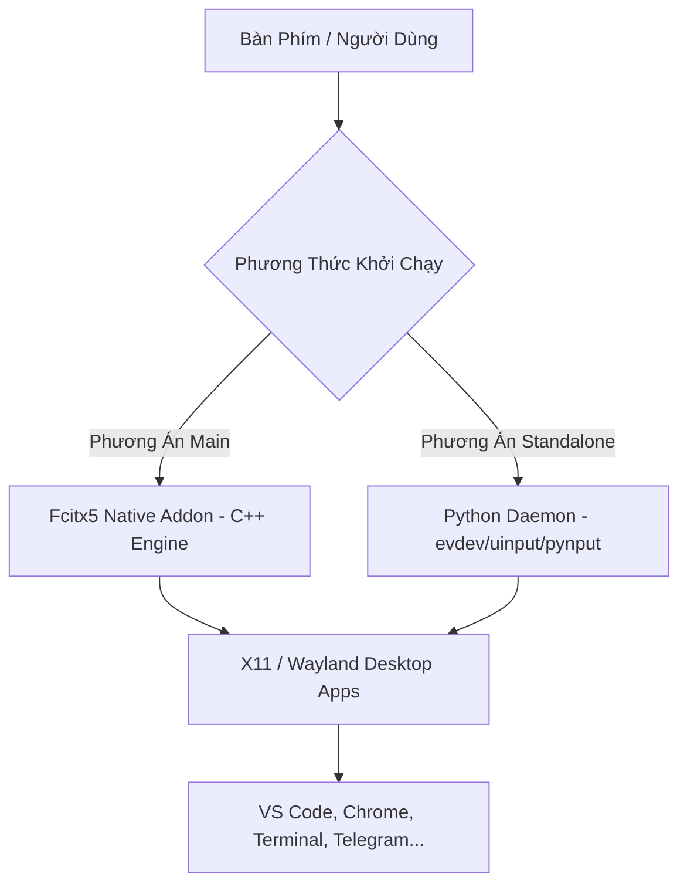

# 🇻🇳 Uniiki - Bộ Gõ Tiếng Việt Toàn Hệ Thống Không Preedit (Linux/Ubuntu)

[](https://ubuntu.com)
[](https://isocpp.org/)
[](https://fcitx-im.org/)
[](https://python.org)
[]()

**Uniiki** là bộ gõ tiếng Việt hiện đại chạy trên Ubuntu/Linux, hỗ trợ gõ **Telex** và **VNI** mượt mà trên **TẤT CẢ các ứng dụng** (Chrome, VS Code, Terminal, Telegram, Slack, Spotify...) mà **HOÀN TOÀN KHÔNG CẦN PREEDIT** (không có gạch chân xem trước, không bị nhấp nháy ô nhập liệu hay xung đột khung gõ).

---

## 🌟 Tại Sao Chọn Uniiki?

* ⚡ **Zero Preedit**: Ký tự tiếng Việt được biến đổi và đưa thẳng vào văn bản ngay tức thì mà không qua ô gạch chân xem trước.
* 🚀 **Kiến Trúc Kép (Dual Architecture)**:
  * **Native Fcitx5 C++ Addon**: Tích hợp trực tiếp vào trình quản lý bộ gõ Fcitx5 cho độ trễ cực thấp và độ ổn định tuyệt đối.
  * **Standalone Python Daemon**: Chạy dạng daemon độc lập với giao diện System Tray (Top Bar) & hỗ trợ các backend `evdev` / `uinput` / `pynput`.
* 🎯 **Tương Thích 100%**: Hoạt động hoàn hảo trên ứng dụng Electron (VS Code, Discord), ứng dụng GTK/Qt, Trình duyệt web và Terminal (X11 & Wayland).
* ⚙️ **Quy Tắc Đặt Dấu**: Hỗ trợ chuẩn dấu mới (`hòa`, `thủy`) cũng như chuẩn cũ (`hoà`, `thuỷ`).
* 🔄 **Autostart**: Dễ dàng thiết lập tự động khởi động cùng hệ thống.

---

## 🏗️ Kiến Trúc Hệ Thống



---

## ⚡ Cài Đặt Nhanh

### Cách 1: Nạp Addon Native Cho Fcitx5 (Khuyên Dùng)

Yêu cầu cài đặt các gói phụ thuộc trên Ubuntu/Debian:
```bash
sudo apt update
sudo apt install -y cmake extra-cmake-modules g++ pkg-config fcitx5 libfcitx5core-dev libfcitx5config-dev libfcitx5utils-dev
```

Biên dịch và cài đặt vào hệ thống:
```bash
cmake -S fcitx5 -B build/fcitx5 -DCMAKE_INSTALL_PREFIX=/usr
cmake --build build/fcitx5
sudo cmake --install build/fcitx5
fcitx5-remote -r
```

> **Sau khi cài đặt:**
> 1. Mở ứng dụng **Fcitx5 Configuration** (Cấu hình Fcitx5).
> 2. Nhấn nút **`+`** (Thêm bộ gõ), bỏ chọn *"Only Show Current Language"*.
> 3. Tìm từ khóa **Uniiki** và chọn **Add**.

---

### Cách 2: Cài Đặt 1-Click Script (Python Daemon & Autostart)

Mở Terminal và chạy duy nhất lệnh này:
```bash
curl -fsSL https://raw.githubusercontent.com/DatDangg/uniiki/main/install.sh | bash
```
> Script sẽ tự động đồng bộ mã nguồn vào `~/.uniiki`, cài đặt thư viện phụ thuộc, tạo lệnh `uniiki` toàn hệ thống và thêm vào Autostart.

---

### Cách 3: Chạy Thủ Công Từ Mã Nguồn (Source)

```bash
git clone https://github.com/DatDangg/uniiki.git
cd uniiki
pip install -r requirements.txt
python3 main.py
```

---

## ⌨️ Bảng Quy Tắc Gõ (Cheat-sheet)

### 1. Kiểu Gõ Telex (Mặc Định)

| Thao tác | Phím gõ | Kết quả ví dụ |
| :--- | :--- | :--- |
| **Dấu thanh** | `s` (Sắc), `f` (Huyền), `r` (Hỏi), `x` (Ngã), `j` (Nặng), `z` (Xóa dấu) | `as` $\rightarrow$ `á`, `af` $\rightarrow$ `à`, `az` $\rightarrow$ `a` |
| **Mũ chữ** | `aa` $\rightarrow$ `â`, `ee` $\rightarrow$ `ê`, `oo` $\rightarrow$ `ô` | `daang` $\rightarrow$ `đang` |
| **Móc / Trăng**| `aw` $\rightarrow$ `ă`, `ow` $\rightarrow$ `ơ`, `uw` / `w` $\rightarrow$ `ư` | `nawmg` $\rightarrow$ `năm`, `muonw` $\rightarrow$ `mượn` |
| **Chữ Đ** | `dd` $\rightarrow$ `đ` | `ddang` $\rightarrow$ `đang` |

---

### 2. Kiểu Gõ VNI

| Thao tác | Phím gõ | Kết quả ví dụ |
| :--- | :--- | :--- |
| **Dấu thanh** | `1` (Sắc), `2` (Huyền), `3` (Hỏi), `4` (Ngã), `5` (Nặng), `0` (Xóa dấu) | `a1` $\rightarrow$ `á`, `a2` $\rightarrow$ `à` |
| **Mũ / Móc** | `6` (Mũ â/ê/ô), `7` (Móc ơ/ư), `8` (Trăng ă), `9` (Gạch đ) | `a6` $\rightarrow$ `â`, `u7` $\rightarrow$ `ư`, `d9` $\rightarrow$ `đ` |

---

## 🛠️ Tùy Chọn Dòng Lệnh (CLI & Daemon Mode)

Uniiki hỗ trợ các cờ tùy chỉnh linh hoạt khi chạy thông qua Python CLI:

```bash
# Chạy giao diện System Tray (Biểu tượng [VN] trên Top Bar Ubuntu)
python3 main.py

# Chạy chế độ Daemon không giao diện (CLI Mode)
python3 main.py --cli --mode telex

# Chạy với kiểu gõ VNI
python3 main.py --mode vni

# Ép dùng backend Evdev/UInput (tránh trùng lặp phím trên Wayland/X11)
python3 main.py --backend evdev
```

> **Lưu ý với Evdev Backend:** Nếu lệnh báo `/dev/uinput is not writable`, hãy thêm user hiện tại vào group `input`:
> ```bash
> sudo usermod -aG input $USER
> ```
> *(Sau đó đăng xuất và đăng nhập lại để quyền có hiệu lực).*

---

## 🧪 Kiểm Thử & Kiểm Tra Chất Lượng (Testing)

Dự án đi kèm bộ testcase tự động toàn diện cho cả C++ và Python:

```bash
# 1. Chạy toàn bộ Unit Tests của Python Engine
python3 -m unittest discover tests

# 2. Biên dịch và chạy bộ test CTest của Fcitx5 C++ Engine
cmake -S fcitx5 -B build/fcitx5
cmake --build build/fcitx5
ctest --test-dir build/fcitx5 --output-on-failure
```

---

## 🔄 Tự Động Khởi Động (Autostart)

Để Uniiki tự chạy mỗi khi bạn đăng nhập Ubuntu:
```bash
mkdir -p ~/.config/autostart
cp uniiki.desktop ~/.config/autostart/
```

---

## 📄 Giấy Phép (License)

Dự án được phân phối dưới giấy phép open-source. Chi tiết tham khảo trong tệp repository.
